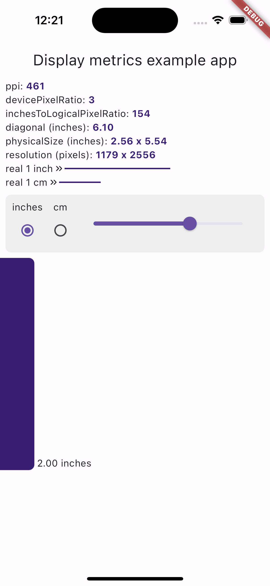

# display_metrics

Flutter plugin that provides display metrics such as real screen resolution, physical display size, ppi, diagonal. Also it contains BuildContext extension to transform inches & centimeters into Flutter logical pixels.

## Features

* Get real screen resolution, display size (inches) and PPI
* Convert inches and centimeters into Flutter logical pixels

## Install

In the `pubspec.yaml` of your flutter project, add the following dependency:

```yaml
dependencies:
  display_metrics: ^0.1.4
```

In your library add the following import:

```dart
import 'package:display_metrics/display_metrics.dart';
```

## Getting started

```dart
class ExampleApp extends StatelessWidget {
  const ExampleApp({super.key});

  @override
  Widget build(BuildContext context) {
    // add DisplayMetricsWidget to Widget tree above MaterialApp to use
    // DisplayMetrics.of(context) and BuildContext extension methods
    return DisplayMetricsWidget(
      child: MaterialApp(
        theme: ThemeData.light(
          useMaterial3: true,
        ),
        home: Scaffold(
          appBar: AppBar(
            title: const Text('Display metrics example app'),
            centerTitle: true,
          ),
          body: const BodyWidget(),
        ),
      ),
    );
  }
}
```


## Usage

### DisplayMetricsData

To access DisplayMetricsData you can call 
```dart
final metrics = DisplayMetrics.maybeOf(context);
// or
final metrics = DisplayMetrics.of(context);
```

```dart
// Device's screen physical size in inches
metrics.physicalSize => Size

// Device's screen resolution in real pixels
metrics.resolution => Size

// Device's screen diagonal in inches
metrics.diagonal => double

// Device's screen pixels per inch (PPI)
metrics.ppi => double 

// The number of logical pixels on the device's screen
// that corresponds to one inch
metrics.inchesToLogicalPixelRatio => double 

// MediaQuery`s devicePixelRatio;
metrics.devicePixelRatio => double 
```

### Convert units
To convert inches and centimeters into Flutter logical pixels and vice versa you can call one of BuildContext extension methods:
```dart
// Converts inches to Flutter logical pixels
context.inchesToPixels(double inches);

// Converts centimeters to Flutter logical pixels
context.cmToPixels(double cm);

// Converts Flutter logical pixels into inches
context.pixelsToInches(int pixels);

// Converts Flutter logical pixels into centimeters
context.pixelsToCm(int pixels);
```

## Credits

iOS implementation uses Jens Schwarzer's UIScreenExtension (https://github.com/marchv/UIScreenExtension)
